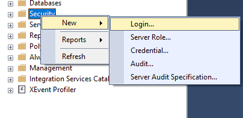
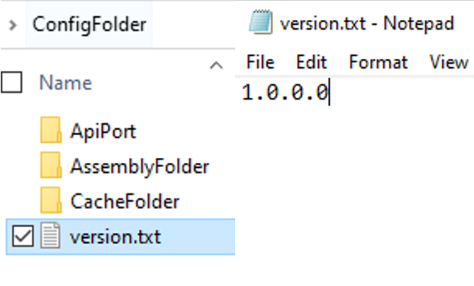
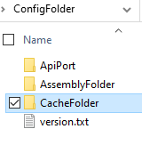
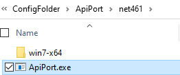
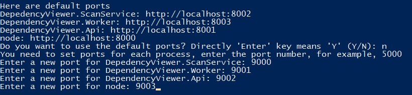
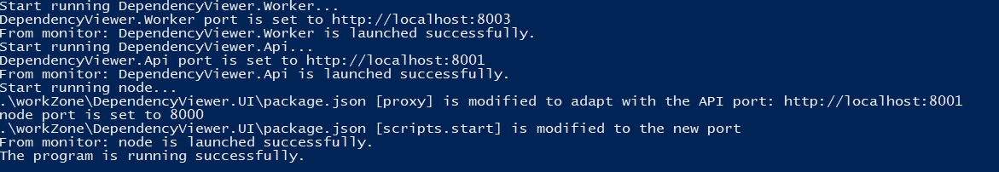

## Introduction

### Dependency Graph Tool
Dependency Graph Tool (DGT) is designed to analyze and display the overall information of APIs' compatibility for .Net Core of different processes/builds in Substrate assemblies.

The main functionalities of the tool contain:
- Management 
1. View the number of compatible and incompatible assemblies. (e.g. Repo and NuGet compatibility.)
2. Track the progress of adapting incompatible assemblies to compatible ones.
- Analysis
1. Analyze the level relationship of assemblies/types. (e.g. paths from a process to an assembly, or paths from one assembly to another.)
- Monitoring
1. Monitor the trend of changes in dependencies. 
2. Detect the changes in the dependencies of assemblies and the dependency tree.

### Architecture
DGT service consists of four processes and is supported by two databases.

#### Processes
- Scan Tool
1. Scan assemblies' information.
-Build Graph Tool
1. Build dependency graphs and import them to the Neo4j database.
2. Analyze relationships between assemblies.
- Web API
1. Querry data from databases.
2. Delivery data to the front end.
- Front End
1. Present data.

#### Databases
- SQL DB
1. Store configuration
- Neo4j
1. Store graph data


## Startup
The Dependency Graph Tool (DGT) depends on SQL Server, Neo4j, JRE, .Net Core 3.1, Node.js, npm packages, and API Port. Please finish the installation and configuration before starting the DGT.

### Neo4j

#### Neo4j Installation
Visit the official website and download [Windows Neo4j Community Edition 3.5.21](https://neo4j.com/download-thanks/?edition=community&release=3.5.21&flavour=winzip&_ga=2.176909797.114973728.1598256184-1237716368.1595239954&_gac=1.195112414.1595902492.CjwKCAjw9vn4BRBaEiwAh0muDCf_xYI1PeoiFtSlHOCWO_yWQkg7QwJMjmjo0Rm-wYihI7v0nc2QMhoCSBMQAvD_BwE).

#### Neo4j Configuration
##### Run Neo4j
###### Run as a Windows Service
Open Command Prompt and direct into Neo4j 3.5.21 file path.
1. Install service, use:
```cmd
bin\neo4j install-service
```
2. Change memory configuration, use: (Note: Set heap.max_size according to your device's memory.)
```cmd
echo dbms.memory.heap.initial_size=8g >> conf\neo4j.conf
echo dbms.memory.heap.max_size=16g >> conf\neo4j.conf
```

3. Start service, use:
```cmd
bin\neo4j start
```
###### Run as a Console Application
Try this method if Neo4j cannot start as a windows service.
Run Neo4j as a console application, use:
```cmd
bin\neo4j console
```
##### Set Neo4j Username and Password
1. Visit the login page of Neo4j. Find the address on the console prompt, for example, http://localhost:7474/.
2. Choose Authentication type as Username / Password, enter neo4j for both username and password to initialize the account.
3. Enter a new password. 
4. Connect Neo4j.
##### Neo4j Host
Neo4j Host can be found after logging in, for example, the Neo4j Host in the figure below is bolt://127.0.0.1:7687.


### SQL Server
#### SQL Server Installation
- Either SQL Server or SQL Server Express is recommended to install.
1. [Click here to download SQL Server.](https://www.microsoft.com/en-us/sql-server/sql-server-downloads)
2. [Click here to download SQL Server Express.](https://www.microsoft.com/en-us/sql-server/sql-server-downloads)
- Use SQL Server Management Studio (SSMS) to manage SQL Server conveniently.
1. [Click here to download SSMS.](https://docs.microsoft.com/en-us/sql/ssms/download-sql-server-management-studio-ssms?view=sql-server-ver15)
#### SQL Server Configuration
##### Authentication
1. Open SSMS -> choose Windows Authentication type -> click Connect.
2. Right-click your server -> choose Properties -> Click Security in the left of the window -> Set Server authentication as SQL Server and Windows Authentication mode.
3. Restart your computer.
##### Connection string
- SQL Server IP:  Server Address. For example, 127.0.0.1 is the IP for the local SQL Server.
- User ID & Password: Create an account to start the server.
1. New Login: Right-click Security -> New -> Login -> Enter Login name -> Choose SQL Server authentication -> Set password -> Click OK.
2. Log in with your username and password: Connect -> set Authentication to SQL Server Authentication type -> enter Login and Password -> Connect.



- Name of your database: Create a new database and record the name of it.
1. Right-click Database -> Click New Database -> Enter Database name -> Click OK. Or use your previous one. Check the name of the database. 


### JRE
Neo4j depends on JRE, please download [jre-8u231-windows-x64.exe](https://www.oracle.com/java/technologies/javase/javase8u211-later-archive-downloads.html#license-lightbox) (only version 8u231 is supported) and install it on your local environment, [more information](https://www.oracle.com/java/technologies/javase-jre8-downloads.html).

### NetCore 3.1
The Dependency Graph Tool is based on .Net Core 3.1, download from [here](https://dotnet.microsoft.com/download/dotnet-core/3.1) if it is not in your local environment, [more Information](https://github.com/dotnet/core/blob/master/release-notes/3.1/3.1.7/3.1.7.md).

### Node.js
Download the latest [Node.js](https://nodejs.org/en/download/), run the script below in command prompt to install. Once the installation succeeded, the command prompt will dispaly the version installed, [more information](https://nodejs.org/en/docs/).
```cmd
node -v
```
### npm
The front-end process of the Dependency Graph Tool (DGT) depends on three npm packages (react-scripts, monaco-editor and cross-env), which will be automatically installed by the commands below triggered by the script OneKeyDeploy.ps1, users do not have to do anything, [more information](https://docs.npmjs.com/).
```cmd
npm i react-scripts
npm i monaco-editor
npm i cross-env
```
### API Port
Download [API Port](https://aka.ms/apiportdownload) and unzip it, no more action required, [more information](https://github.com/microsoft/dotnet-apiport).

## 3. DGT configuration
### 3.1 Folder configuration
Before running the script OneKeyDeploy.ps1, it is necessary to define file paths and the version for the Dependency Graph Tool (DGT). It determines which files will be scanned by DGT.

The following paragraph is based on the default config folder, ConfigFolder, containing ApiPort, AssemblyFolder, CacheFolder, and version.txt. The content in the ConfigFolder will be used in a [demo](https://app.gitbook.com/@microsoft-12/s/dependency-graph-tool/deploy/demo) described in the next chapter. **The configuration of the demo is used as the default configuration**.


**Default Config Folder**

#### Assembly Folder Path
The physical path of the folder containing assembly files to be scanned. Under the assembly folder, files to be scanned are stored in the corresponding sub-folders in the assembly folder. For example, If the [assembly file version](https://docs.microsoft.com/en-us/dotnet/standard/assembly/versioning) of the repo is 1.0.0.0, it is required to create a folder in the assembly folder, naming it as 1.0.0.0. Then put files to be scanned in the Folder 1.0.0.0.


**Assembly Folder**

#### Version Folder Path
The location of the version.txt file that stores an assembly file version, for example, 1.0.0.0. If 1.0.0.0 is set in version.txt, the DGT will scan files in the folder with the path AssemblyFolder/1.0.0.0.


**version.txt and its content**

#### Cache Folder Path
Scanned results will be stored under this path.


**Cache Folder**

#### ApiPort Path
The physical path of ApiPort.exe or ApiPort.dll. The ApiPort can determine the compatibility of an API.


**ApiPort.exe**

#### Customised Folder Configuration
Users are allowed to customize the configuration by following the steps below.
1. Create an assembly folder.
2. Create a version.txt and enter a version corresponding to the repo's assembly file version (For example, if the repo's assembly file version is 1.0.0.3, then the content of the version.txt must be 1.0.0.3.).
3.Create a subfolder with a name same as the assembly's file version (1.0.0.3) in the assembly folder.
4. Put files to be scanned into the subfolder (1.0.0.3).
5. Create a cache folder.

#### Note 
>* Users are allowed to add files to be scanned in the assembly folder and define the corresponding version in the version.txt, but do not change the ConfigFolder structure when running the script for the first time. 
>* After running the service successfully, users can modify the folder configuration (must be matched with the customized folder configuration) in the Repo Config page.
>* Users are recommended to keep the default path parameters (Version File Path, Assembly Folder Path, and Cache Folder Path). Files to be scanned can be moved to the assembly folder in the default Assembly Folder Path, instead of creating a new assembly folder.

### 3.2 Script configuration
#### Listening Ports
>* The script will start four processes which require four different listening ports. 
>* http://localhost:8000 to 8003 are used to set the default listening ports.
>* Users are allowed to customize listening ports in the script.


**Customized Listening Ports**

#### Neo4j and SQL Server Configuration
Enter the Neo4j and SQL Server configuration in the script (using parameters from 2.1.2 and 2.2.2).

**Configure with Neo4j and Sql Server**

#### Repo Name
Name of the repo, the default name is DefaultRepo, open to be modified when running the script.


### 3.3 UI configuration
#### 3.3.1 Process Config
>* Process Name: Give a name to the current process.
>* Start Assemblies: Add or delete start assemblies for the current process.

[More information](https://app.gitbook.com/@microsoft-12/s/dependency-graph-tool/operation-manual/system/process-config)

#### 3.3.2 Repo Config
>* .NET Core Exts: .NET Core Extension Support Version. Includes the .NET Core APIs in addition to the Windows Compatibility Pack, which provides many of the .NET Framework available technologies. This is a recommended target for porting your app from .NET Framework to .NET Core on Windows.
>* .NET Standard Exts: .NET Standard Extension Support Version. Includes the .NET Core APIs in addition to the Windows Compatibility Pack, which provides many of the .NET Framework available technologies. This is a recommended target for porting your app from .NET Framework to .NET Core on Windows.
  >* .Net Core Exts and .Net Standard Exts determine whether an API is compatible or incompatible. The rule is: an API is supported if one of its versions is either below .NET Core Exts or .NET Standard Exts, otherwise, the API is not supported. Configuring with a version number 0 is going to disable the check. 
  >* Compatible means an API can work in a new environment. When setting configurations, you are allowed to set X2 and Y2 shown in the figure below.

**The condition of Api is compatible in a new environment**
>* Repo: Name of the repo.
>* Assembly Folder Path
>* Cache Folder Path
>* ApiPort Path
>* Version File Path

##### Default Configuration
Users are allowed to modify the default configuration.

**Default Configuration**
[More Information](https://app.gitbook.com/@microsoft-12/s/dependency-graph-tool/operation-manual/system/repo-config)

### 3.4 Recurring job configuration
In the default configuration, the recurring job function is disabled, meaning the DGT can only scan files once, then analyze and indicate results. If the DGT is required to implement the recurring job (scan files multiple times in a specific time interval).

#### Configuration
The recurring job is enabled by setting "CrontabString". The "CrontabString" format consists of five fields, and it can convert into a time interval. The default value of "CrontabString" is "* * * * *", meaning the recurring job function is disabled. [More information about setting "CrontabString"](https://en.wikipedia.org/wiki/Cron).

Follow the steps below to set the  "CrontabString".
1. Find the appsettings.json file in the path .\workZone\ReleaseScan\netcoreapp3.1\appsettings.json.
2. Open the file, set the value of "CrontabString", then close the file.
3. Set a version in the version.txt, which determines the next folder to be scanned.

#### Note
>* When setting the value of "CrontabString" in the appsettings.json, please do not modify other values.
>* If the recurring job function is enabled, please do not close any running process of the DGT.

## 4. Deployment

### 4.1 Assembly package demo
#### Demo files
The assembly package demo consists of two folders, each folder corresponds to a version, 1.0.0.0 and 1.0.0.1, they are prepared for the Dependency Graph Tool (DGT) to scan, analyze, and draw the graph. The structures of the files in each folder are shown below.


**Folder 1.0.0.0**

Folder 1.0.0.0 consists of **Root.dll**, **Son.dll**, **Daughter.dll**, **Grandson.dll**, **Nuget.Common.dll** and **SimpleInjector.dll**. Root.dll file is the start assembly file.
### Start with a script


**Folder 1.0.0.1**

Folder 1.0.0.1 consists of **Root.dll**, **Son.dll**, **Daughter.dll**, **Grandson.dll**, **Granddaughter.dll**, **Nuget.Common.dll** and **SimpleInjector.dll**. Root.dll file is the start assembly file.

#### Note 
>* 1.0.0.0 and 1.0.0.1 are [assembly file versions](https://docs.microsoft.com/en-us/dotnet/standard/assembly/versioning), which means in Folder 1.0.0.0, all the assembly file versions of the repo are 1.0.0.0. The rule also adapts to Folder 1.0.0.1.
>* In the figures of the files structures, system assemblies have been hidden.
>* The dependency relation between every two nodes is similar to that of the ethical relation. For example, Root.dll node depends on Son.dll and Daughter.dll nodes. Son.dll node depends on Grandson.dll and Nuget.Common.dll nodes.
>* In most cases, all the assembly file versions of a repo are the same, which can help to differentiate whether the current repo is NuGet or not.
>* Generally, the assembly file version is the same as the [build version](https://searchsoftwarequality.techtarget.com/definition/build). Get [more information](https://docs.microsoft.com/en-us/dotnet/standard/assembly/set-attributes) here if user demands to change the assembly file version.

**The assembly file version is the same as the build version (product version).**

### 4.2 Start with a script
DGT is supported by Windows OS. Before running DGT, make sure PowerShell as been installed. Right-click OneKeyDeploy.ps1, then click Run with PowerShell.

#### Procedure
The script OneKeyDeploy.ps1 will help you conveniently start the Dependency Graph Tool (DGT). The basic procedure of it is listed below:
>* Set a version in version.txt.
>* Set listening ports for four processes.
>* Configure with [SQL Server]() and [Neo4j]().
>* Choose to run a demo mode or run the DGT based on the customized settings.
```powershell
Do you want to have a quick start with a demo (pre-prepared asembly files will be scanned and analyzed)? 'Enter' key means 'Y'. (Y/N)
```
>* Start four processes.
>* Monitor four processes.

**Start and monitor 4 processes**

#### Decision Tree
The decision tree indicates the main decisions made in the script and the corresponding results.## Operation Manual

**Decision Tree of the script**

#### Scan and analyze your files
Customize settings.
>* Activate the recurring job or not.
>* Create a new folder with a name same as your repo's assembly file version in Assembly Folder.
>* Add files to be scanned into the new folder.
>* Set the content of the version.txt corresponding to the version of the assembly files.
>* Run the script.
>* Set listening ports for four processes in the script.
>* Set or keep SQL Server and Neo4j configurations in the script.
>* Initialize tables in SQL Server or not in the script.
>* Customize a repo name in the script.
>* Service starts.
>* Edit configuration in the  Repo Config page in UI.
>* Add a new process in the Process Config page in UI.

#### Note
Use default settings and demo to have a quick start.
>* Run the script.
>* Use the default listening ports in the script.
>* Enter SQL Server and Neo4j configurations in the script.
>* Choose the demo mode.
>* Service starts.

Users are allowed to reset tables in SQL Server.

**Reset tables**

## 5. Operation Manual
### Dashboard
### Tools
#### Process's Root Parents
#### Process to Assembly Path
#### Assembly to Assembly Path
#### Process's Assemblies
#### Assembly Details
#### Difference
#### New Assembly Check
#### Assembly Children Paths

### Type Analysis
#### Process's Types
#### One Shortest Path Process to Type
#### One Shortest Path From Assembly to Type
#### Multi-Path Process to Type
#### Multi-Path Assembly to Type


### System
#### Process Config
#### Repo Config
#### Import Status
#### Error Log

