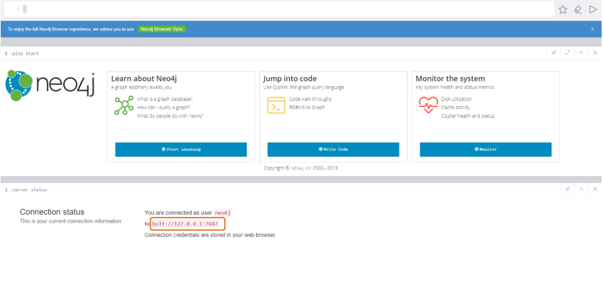
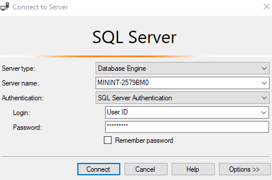
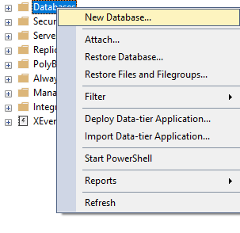

## Introduction

### Dependency Graph Tool
Dependency Graph Tool (DGT) is designed to analyze and display the overall information of APIs' compatibility for .Net Core of different processes/builds in Substrate assemblies.

The main functionalities of the tool contain:
- Management 
1. View the number of compatible and incompatible assemblies. (e.g. Repo and NuGet compatibility.)
2. Track the progress of adapting incompatible assemblies to compatible ones.
- Analysis
1. Analyze the level relationship of assemblies/types. (e.g. paths from a process to an assembly, or paths from one assembly to another.)
- Monitoring
1. Monitor the trend of changes in dependencies. 
2. Detect the changes in the dependencies of assemblies and the dependency tree.

### Architecture
DGT service consists of four processes and is supported by two databases.

#### Processes
- Scan Tool
1. Scan assemblies' information.
-Build Graph Tool
1. Build dependency graphs and import them to the Neo4j database.
2. Analyze relationships between assemblies.
- Web API
1. Querry data from databases.
2. Delivery data to the front end.
- Front End
1. Present data.

#### Databases
- SQL DB
1. Store configuration
- Neo4j
1. Store graph data


## Startup
The Dependency Graph Tool (DGT) depends on SQL Server, Neo4j, JRE, .Net Core 3.1, Node.js, npm packages, and API Port. Please finish the installation and configuration before starting the DGT.

### Neo4j

#### Neo4j Installation
Visit the official website and download [Windows Neo4j Community Edition 3.5.21](https://neo4j.com/download-thanks/?edition=community&release=3.5.21&flavour=winzip&_ga=2.176909797.114973728.1598256184-1237716368.1595239954&_gac=1.195112414.1595902492.CjwKCAjw9vn4BRBaEiwAh0muDCf_xYI1PeoiFtSlHOCWO_yWQkg7QwJMjmjo0Rm-wYihI7v0nc2QMhoCSBMQAvD_BwE).

#### Neo4j Configuration
##### Run Neo4j
###### Run as a Windows Service
Open Command Prompt and direct into Neo4j 3.5.21 file path.
1. Install service, use:
```cmd
bin\neo4j install-service
```
2. Change memory configuration, use: (Note: Set heap.max_size according to your device's memory.)
```cmd
echo dbms.memory.heap.initial_size=8g >> conf\neo4j.conf
echo dbms.memory.heap.max_size=16g >> conf\neo4j.conf
```

3. Start service, use:
```cmd
bin\neo4j start
```
###### Run as a Console Application
Try this method if Neo4j cannot start as a windows service.
Run Neo4j as a console application, use:
```cmd
bin\neo4j console
```
##### Set Neo4j Username and Password
1. Visit the login page of Neo4j. Find the address on the console prompt, for example, http://localhost:7474/.
2. Choose Authentication type as Username / Password, enter neo4j for both username and password to initialize the account.
3. Enter a new password. 
4. Connect Neo4j.
##### Neo4j Host
Neo4j Host can be found after logging in, for example, the Neo4j Host in the figure below is bolt://127.0.0.1:7687.


### SQL Server
#### SQL Server Installation
- Either SQL Server or SQL Server Express is recommended to install.
1. [Click here to download SQL Server.](https://www.microsoft.com/en-us/sql-server/sql-server-downloads)
2. [Click here to download SQL Server Express.](https://www.microsoft.com/en-us/sql-server/sql-server-downloads)
- Use SQL Server Management Studio (SSMS) to manage SQL Server conveniently.
1. [Click here to download SSMS.](https://docs.microsoft.com/en-us/sql/ssms/download-sql-server-management-studio-ssms?view=sql-server-ver15)
#### SQL Server Configuration
##### Authentication
1. Open SSMS -> choose Windows Authentication type -> click Connect.
2. Right-click your server -> choose Properties -> Click Security in the left of the window -> Set Server authentication as SQL Server and Windows Authentication mode.
3. Restart your computer.
##### Connection string
- SQL Server IP:  Server Address. For example, 127.0.0.1 is the IP for the local SQL Server.
- User ID & Password: Create an account to start the server.
1. New Login: Right-click Security -> New -> Login -> Enter Login name -> Choose SQL Server authentication -> Set password -> Click OK.
2. Log in with your username and password: Connect -> set Authentication to SQL Server Authentication type -> enter Login and Password -> Connect.




- Name of your database: Create a new database and record the name of it.
1. Right-click Database -> Click New Database -> Enter Database name -> Click OK. Or use your previous one. Check the name of the database. 



### JRE
Neo4j depends on JRE, please download [jre-8u231-windows-x64.exe](https://www.oracle.com/java/technologies/javase/javase8u211-later-archive-downloads.html#license-lightbox) (only version 8u231 is supported) and install it on your local environment, [more information](https://www.oracle.com/java/technologies/javase-jre8-downloads.html).

### NetCore 3.1
The Dependency Graph Tool is based on .Net Core 3.1, download from [here](https://dotnet.microsoft.com/download/dotnet-core/3.1) if it is not in your local environment, [more Information](https://github.com/dotnet/core/blob/master/release-notes/3.1/3.1.7/3.1.7.md).

### Node.js
Download the latest [Node.js](https://nodejs.org/en/download/), run the script below in command prompt to install. Once the installation succeeded, the command prompt will dispaly the version installed, [more information](https://nodejs.org/en/docs/).
```cmd
node -v
```
### npm
The front-end process of the Dependency Graph Tool (DGT) depends on three npm packages (react-scripts, monaco-editor and cross-env), which will be automatically installed by the commands below triggered by the script OneKeyDeploy.ps1, users do not have to do anything, [more information](https://docs.npmjs.com/).
```cmd
npm i react-scripts
npm i monaco-editor
npm i cross-env
```
### API Port
Download [API Port](https://aka.ms/apiportdownload) and unzip it, no more action required, [more information](https://github.com/microsoft/dotnet-apiport).

## DGT configuration
### Folder configuration
### Script configuration
### UI configuration
### Recurring job configuration


## Deployment
### Assembly package demo
### Start with a script

## Operation Manual
### Dashboard
### Tools
#### Process's Root Parents
#### Process to Assembly Path
#### Assembly to Assembly Path
#### Process's Assemblies
#### Assembly Details
#### Difference
#### New Assembly Check
#### Assembly Children Paths

### Type Analysis
#### Process's Types
#### One Shortest Path Process to Type
#### One Shortest Path From Assembly to Type
#### Multi-Path Process to Type
#### Multi-Path Assembly to Type


### System
#### Process Config
#### Repo Config
#### Import Status
#### Error Log

