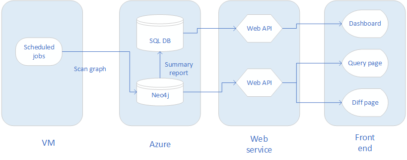
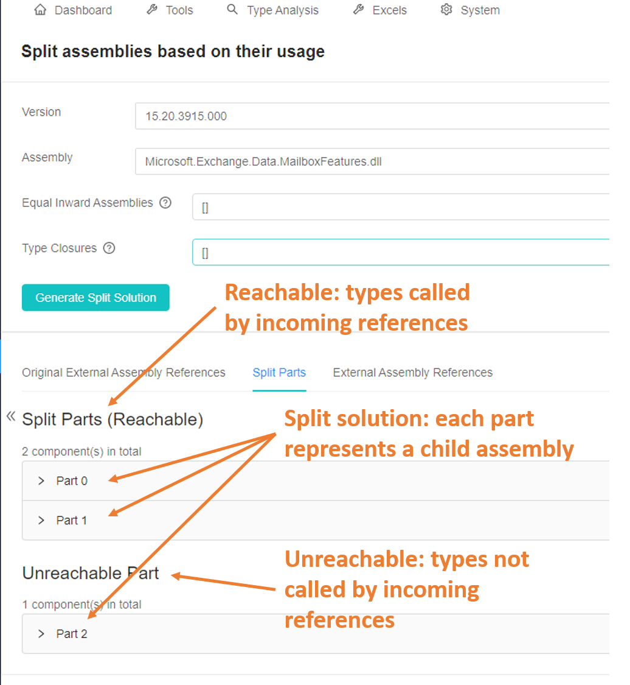

# 1. Introduction

Dependency Graph Tool (DGT) is designed to analyze and display the overall information of APIs' compatibility for .Net Core of different processes/builds in Substrate assemblies.

The main functionalities of DGT contain:
- Management
  - View the number of compatible and incompatible assemblies. (e.g. Repo and NuGet compatibility.)
  - Track the progress of adapting incompatible assemblies to compatible ones.
- Analysis
  - Analyze the level relationship of assemblies/types. (e.g. paths from a root assembly of a process to some assembly, or paths between assemblies.)
- Monitoring
  - Monitor the trend of changes in dependencies. 
  - Detect the changes in the dependency tree.

## 1.1 Architecture

DGT service consists of four processes and is supported by two databases.

### 1.1.1 Processes

- Scan Tool
  - Scan assemblies' information.
- Build Graph Tool
  - Build dependency graphs and import them to the Neo4j database.
  - Analyze relationships between assemblies.
- Web API
  - Querry data from databases.
  - Delivery data to the front end.
- Front End
  - Present data.

  
  
  **Data flow**

### 1.1.2 Databases

- SQL DB
  - Store configuration
- Neo4j
  - Store graph data


**The database schema**

---

# 2. Startup

DGT depends on **SQL Server**, **Neo4j**, **JRE**, **.Net Core 3.1**, **Node.js**, **npm packages** and **API Port**. Please finish the installation and configuration before launching DGT.

## 2.1 Neo4j

### 2.1.1 Neo4j Installations

Visit the official website and download [Windows Neo4j Community Edition 3.5.21](https://neo4j.com/download-thanks/?edition=community&release=3.5.21&flavour=winzip&_ga=2.176909797.114973728.1598256184-1237716368.1595239954&_gac=1.195112414.1595902492.CjwKCAjw9vn4BRBaEiwAh0muDCf_xYI1PeoiFtSlHOCWO_yWQkg7QwJMjmjo0Rm-wYihI7v0nc2QMhoCSBMQAvD_BwE).

### 2.1.2 Neo4j Configuration

#### Run Neo4j

##### Run as a Windows Service

Open Command Prompt and direct into Neo4j 3.5.21 file path.
1. Install service, use:
```cmd
bin\neo4j install-service
```
2. Change memory configuration, use: (Note: Set heap.max_size according to your device's memory.)
```cmd
echo dbms.memory.heap.initial_size=8g >> conf\neo4j.conf
echo dbms.memory.heap.max_size=16g >> conf\neo4j.conf
```
3. Start service, use:
```cmd
bin\neo4j start
```

##### Run as a Console Application

Try this method if Neo4j cannot start as a windows service.
Run Neo4j as a console application, use:
```cmd
bin\neo4j console
```

#### Set Neo4j Username and Password

1. Visit the login page of Neo4j. Find the address on the console prompt, for example, http://localhost:7474/.
2. Choose Authentication type as Username / Password, enter neo4j for both username and password to initialize the account.
3. Enter a new password. 
4. Connect Neo4j.

#### Neo4j Host

Neo4j Host can be found after logging in, for example, the Neo4j Host in the figure below is bolt://127.0.0.1:7687.


## 2.2 SQL Server

### 2.2.1 SQL Server Installation

- Either SQL Server or SQL Server Express is recommended.
  - [Download SQL Server.](https://www.microsoft.com/en-us/sql-server/sql-server-downloads)
  - [Download SQL Server Express.](https://www.microsoft.com/en-us/sql-server/sql-server-downloads)
- Use SQL Server Management Studio (SSMS) to manage SQL Server conveniently.
  - [Download SSMS.](https://docs.microsoft.com/en-us/sql/ssms/download-sql-server-management-studio-ssms?view=sql-server-ver15)

### 2.2.2 SQL Server Configuration

#### [Authentication](https://docs.microsoft.com/en-us/sql/relational-databases/security/choose-an-authentication-mode?view=sql-server-ver15)

1. Open SSMS -> choose **Windows Authentication** type -> click **Connect**.
2. Right-click your server -> choose **Properties** -> Click **Security** in the left of the window -> Set **Server authentication** as **SQL Server and Windows Authentication mode**.
3. Restart your computer.

#### [Connection string](https://docs.microsoft.com/en-us/dotnet/api/system.data.sqlclient.sqlconnection.connectionstring?view=dotnet-plat-ext-3.1)

- [SQL Server IP](https://docs.microsoft.com/en-us/sql/tools/configuration-manager/tcp-ip-properties-ip-addresses-tab?view=sql-server-ver15): Server Address. For example, 127.0.0.1 is the IP for the local SQL Server.
- [User ID & Password](https://docs.microsoft.com/en-us/sql/relational-databases/security/authentication-access/create-a-login?view=sql-server-ver15): Create an account to start the server.
  - New Login: Right-click **Security** -> **New** -> **Login** -> Enter Login name -> Choose **SQL Server authentication** -> Set password -> Click **OK**.
  - Log in with your username and password: Connect -> set **Authentication** to **SQL Server Authentication** type -> enter **Login** and **Password** -> **Connect**.


**Create login**


**Set User ID and Password**


**User ID and password**

- [Name of your database](https://docs.microsoft.com/en-us/sql/relational-databases/tables/create-tables-database-engine?view=sql-server-ver15): Create a new database and record the name of it.
  - Right-click **Database** -> Click **New Database** -> Enter Database name -> Click **OK**. Or use your previous one. Check the name of the database. 


**Create a new database**


**Set name of the database and click OK**

#### Note

- If you cannot create a new database in your personal SQL server account, please create it in **sa** account. Then, check if your personal account owns this database.
- Please **log in SQL Server with your Login and Password, and make sure you are allowed to add and edit tables in your database**. If you find that your account does not have such permission, please check whether your account is the db_owner of your database.
  - Open the server -> Security -> Login -> Right-click **sa** account -> Choose propertites -> Set new password -> Click Status in the left of the window -> Set Login **Enable** -> Click **OK**.
  - Open the server -> Connect Server with **sa** account and your **sa**'s password -> **Security** -> **Login** -> Right-click your **personal** account -> Choose **propertites** -> Choose **User Mapping** in the left of the window -> Add your database to your Login -> add **db_owner** -> Click **OK**.


**Add db_owner to your database**

- Your **SQL Server IP**, **name of the database**, **Login Username** and **Password** will be used in further steps.

## 2.3 JRE

Neo4j depends on JRE, please download [jre-8u231-windows-x64.exe](https://www.oracle.com/java/technologies/javase/javase8u211-later-archive-downloads.html#license-lightbox) (only version 8u231 is supported) and install it onto your local environment, [more information](https://www.oracle.com/java/technologies/javase-jre8-downloads.html).

## 2.4 NetCore 3.1

DGT is based on .Net Core 3.1, download from [here](https://dotnet.microsoft.com/download/dotnet-core/3.1) if it is not in your local environment, [more Information](https://github.com/dotnet/core/blob/master/release-notes/3.1/3.1.7/3.1.7.md).

## 2.5 Node.js

- Download the latest [Node.js](https://nodejs.org/en/download/). Once the installation succeeded, the Command Prompt will dispaly the version installed, [more information](https://nodejs.org/en/docs/).
- Run below script at Command Prompt to verify the installation.

```cmd
node -v
```

## 2.6 npm

The front-end process of the DGT depends on three npm packages (react-scripts, monaco-editor and cross-env), which will be automatically installed by the commands below triggered by the script OneKeyDeploy.ps1, users do not have to do anything, [more information](https://docs.npmjs.com/).

```cmd
npm i react-scripts
npm i monaco-editor
npm i cross-env
```

## 2.7 API Port

Download [API Port](https://aka.ms/apiportdownload) and unzip it, no more action is required, [more information](https://github.com/microsoft/dotnet-apiport).

---

# 3. DGT configuration

- [3.1](#3.1-Folder-configuration) and [3.2](#3.2-Script-configuration) are necessary to launch DGT service.
- It is recommended to go to [3.3](#3.3-UI-configuration) after DGT is launched successfully.
- [3.4](#3.4-Recurring-job-configuration) is an optional chapter for activating recurring jobs.

## 3.1 Folder configuration

Before running the script OneKeyDeploy.ps1, it is necessary to define file paths and the version for DGT. It determines which files will be scanned by DGT.

The following paragraph is based on the default config folder, ConfigFolder, containing ApiPort, AssemblyFolder, CacheFolder, and version.txt. The content in the ConfigFolder will be used in a [demo](#4.1-Assembly-package-demo) described in the next chapter. **The configuration of the demo is used as the default configuration**.


**Default Config Folder**

### Assembly Folder Path

The physical path of the folder containing assembly files to be scanned. Under the assembly folder, files to be scanned are stored in the corresponding sub-folders in the assembly folder. For example, If the [assembly file version](https://docs.microsoft.com/en-us/dotnet/standard/assembly/versioning) of the repo is 1.0.0.0, it is required to create a folder in the assembly folder, naming it as 1.0.0.0. Then put files to be scanned in the Folder 1.0.0.0.


**Assembly Folder**

### Version Folder Path

The location of the version.txt file that stores an assembly file version, for example, 1.0.0.0. If 1.0.0.0 is set in version.txt, the DGT will scan files in the folder with the path AssemblyFolder/1.0.0.0.


**version.txt and its content**

### Cache Folder Path

Scanned results will be stored under this path.


**Cache Folder**

### [ApiPort](#2.7-API-Port) Path

The physical path of ApiPort.exe or ApiPort.dll. The ApiPort can determine the compatibility of an API.


**ApiPort.exe**

### Customised Folder Configuration

Users are allowed to customize the configuration by following the steps below.
1. Create an assembly folder.
2. Create a version.txt and enter a version corresponding to the repo's assembly file version (For example, if the repo's assembly file version is 1.0.0.3, then the content of the version.txt must be 1.0.0.3.).
3.Create a subfolder with a name same as the assembly's file version (1.0.0.3) in the assembly folder.
4. Put files to be scanned into the subfolder (1.0.0.3).
5. Create a cache folder.

#### Note

- Users are allowed to add files to be scanned in the assembly folder and define the corresponding version in the version.txt, but do not change the ConfigFolder structure when running the script for the first time. 
- After running the service successfully, users can modify the folder configuration (must be matched with the customized folder configuration) in the [Repo Config](#3.3.2-Repo-Config) page.
- Users are recommended to keep the default path parameters (Version File Path, Assembly Folder Path, and Cache Folder Path). Files to be scanned can be moved to the assembly folder in the default Assembly Folder Path, instead of creating a new assembly folder.

## 3.2 Script configuration

### Listening Ports

- The script will start four processes which require four different listening ports. 
- http://localhost:8000 to 8003 are used to set the default listening ports.
- Users are allowed to customize listening ports in the script.


**Customized Listening Ports**

### Neo4j and SQL Server Configuration

Enter the Neo4j and SQL Server configuration in the script (using parameters from [2.1.2](#2.1.2-Neo4j-configuration) and [2.2.2](#2.2.2-SQL-Server-configuration)).


**Configure with Neo4j and Sql Server**

### Repo Name

Name of the repo, the default name is **DefaultRepo**, open to be modified when running the script.


## 3.3 UI configuration

### 3.3.1 Process Config

- Process Name: Give a name to the current process.
- Start Assemblies: Add or delete start assemblies for the current process.

[More information](https://app.gitbook.com/@microsoft-12/s/dependency-graph-tool/operation-manual/system/process-config)

### 3.3.2 Repo Config

- [.NET Core Exts](https://docs.microsoft.com/en-us/dotnet/standard/analyzers/portability-analyzer): .NET Core Extension Support Version. Includes the .NET Core APIs in addition to the Windows Compatibility Pack, which provides many of the .NET Framework available technologies. This is a recommended target for porting your app from .NET Framework to .NET Core on Windows.
- [.NET Standard Exts](https://docs.microsoft.com/en-us/dotnet/standard/analyzers/portability-analyzer): .NET Standard Extension Support Version. Includes the .NET Core APIs in addition to the Windows Compatibility Pack, which provides many of the .NET Framework available technologies. This is a recommended target for porting your app from .NET Framework to .NET Core on Windows.
  - **.Net Core Exts** and **.Net Standard Exts** determine whether an API is compatible or incompatible. The rule is: an API is supported if one of its versions is either below .NET Core Exts or .NET Standard Exts, otherwise, the API is not supported. Configuring with a version number **0** is going to disable the check. 
  - **Compatible** means an API can work in a new environment. When setting configurations, you are allowed to set **X2** and **Y2** shown in the figure below.


**The condition of Api is compatible in a new environment**

- Repo: Name of the repo.
- Assembly Folder Path
- Cache Folder Path
- ApiPort Path
- Version File Path

#### Default Configuration

Users are allowed to modify the default configuration.


**Default Configuration**

[More Information](https://app.gitbook.com/@microsoft-12/s/dependency-graph-tool/operation-manual/system/repo-config)

## 3.4 Recurring job configuration

Recurring job means scanning files multiple times in a specific time interval, this function is disabled by default, which means DGT only scan files once before analyzing and indicating results. 

Recurring job can be manually enabled by setting "CrontabString". The "CrontabString" format consists of five fields, and can convert into a time interval. The default value of "CrontabString" is "* * * * *", which means the recurring job is disabled. [More information about setting "CrontabString"](https://en.wikipedia.org/wiki/Cron).

Follow the steps below to set the "CrontabString".
1. Find the appsettings.json file from the path *.\workZone\ReleaseScan\netcoreapp3.1\appsettings.json*.
2. Open the file, set the value of "CrontabString" and close it.
3. Set a version in the version.txt, which determines the next folder to be scanned.

#### Note

- Do not modify any other value when setting "CrontabString" in the appsettings.json.
- If the recurring job function is enabled, do not close any running process of DGT.

---

# 4. Deployment

## 4.1 Assembly package demo

### Demo files

The assembly package demo consists of two folders, either folder corresponds to version 1.0.0.0 and 1.0.0.1 respectively, they are prepared for DGT to scan, analyze and generate the graph. The structures of the files in both folders are shown below.


**Folder 1.0.0.0**

Folder 1.0.0.0 consists of **Root.dll**, **Son.dll**, **Daughter.dll**, **Grandson.dll**, **Nuget.Common.dll** and **SimpleInjector.dll**. Root.dll file is the start assembly file.
### Start with a script


**Folder 1.0.0.1**

Folder 1.0.0.1 consists of **Root.dll**, **Son.dll**, **Daughter.dll**, **Grandson.dll**, **Granddaughter.dll**, **Nuget.Common.dll** and **SimpleInjector.dll**. Root.dll file is the start assembly file.

#### Note 

- 1.0.0.0 and 1.0.0.1 are [assembly file versions](https://docs.microsoft.com/en-us/dotnet/standard/assembly/versioning), which means in Folder 1.0.0.0, all the assembly file versions of the repo are 1.0.0.0. The rule also adapts to Folder 1.0.0.1.
- In the figures of the files structures, system assemblies have been hidden.
- The dependency relation between every two nodes is similar to that of the ethical relation. For example, Root.dll node depends on Son.dll and Daughter.dll nodes. Son.dll node depends on Grandson.dll and Nuget.Common.dll nodes.
- In most cases, all the assembly file versions of a repo are the same, which can help to differentiate whether the current repo is NuGet or not.
- Generally, the assembly file version is the same as the [build version](https://searchsoftwarequality.techtarget.com/definition/build). Get [more information](https://docs.microsoft.com/en-us/dotnet/standard/assembly/set-attributes) here if user demands to change the assembly file version.


**The assembly file version is the same as the build version (product version).**

## 4.2 Start with a script

DGT is supported by Windows OS. Before running DGT, make sure [PowerShell](https://docs.microsoft.com/en-us/powershell/) has been installed. Right-click **OneKeyDeploy.ps1**, then click **Run with PowerShell**.

### Procedure

The script OneKeyDeploy.ps1 will help you conveniently start DGT. The basic procedure is listed below:
- Set a version in version.txt.
- Set listening ports for four processes.
- Configure with [SQL Server](#2.2.2-SQL-Server-Configuration) and [Neo4j](#2.1.2-Neo4j-configuration).
- Choose to run a demo mode or run the DGT based on the customized settings.

```
Do you want to have a quick start with a demo (pre-prepared asembly files will be scanned and analyzed)? 'Enter' key means 'Y'. (Y/N)
```
- Start four processes.
- Monitor four processes.


**Start and monitor 4 processes**

### Decision Tree

The decision tree indicates the main decisions made in the script and the corresponding results.


**Decision Tree of the script**

### Scan and analyze your files

Customize settings.
- Activate the [recurring job](#3.4-Recurring-job-configuration) or not.
- Create a new folder with a name same as your repo's assembly file version in Assembly Folder.
- Add files to be scanned into the new folder.
- Set the content of the version.txt corresponding to the version of the assembly files.
- Run the script.
- Set listening ports for four processes in the script.
- Set or keep SQL Server and Neo4j configurations in the script.
- Initialize tables in SQL Server or not in the script.
- Customize a repo name in the script.
- Service starts.
- Edit configuration in the [Repo Config](#5.4.2-Repo-Config) page in UI.
- Add a new process in the [Process Config](#5.4.1-Process-Config) page in UI.

#### Note

Use default settings and demo to have a quick start.
- Run the script.
- Use the default listening ports in the script.
- Enter SQL Server and Neo4j configurations in the script.
- Choose the demo mode.
- Service starts.

Users are allowed to reset tables in SQL Server.
 


**Reset tables**

---

# 5. Operation Manual

## 5.1 Dashboard

This page is designed to display overall information of compatible and incompatible APIs of different processes in different builds. The data of this page is from analyzing the demo we have prepared.

### Charts

The dashboard contains four charts.
- [Pie charts of version's status](#Pie-charts-of-version's-status), showing the number of compatible and incompatible APIs.
- [Trend over builds](#Trend-over-builds), showing the version status change over time.
- [Overlaps per build](#Overlaps-per-build), showing the impact on other processes.
- [All processes per build](#All-processes-per-build), showing the overall situation for all onboard processes.


**Dashboard overview**

#### Pie charts of version's status


**Proportion of compatibles and incompatibles**

- Total: Sum of the compatible and incompatible APIs from DefaultRepo and Nuget. For example, in the figure above, the number of compatible APIs in Total, 14, comes from 4 compatible APIs in DefaultRepo and 10 Compatible APIs from Nuget; and the number of Incompatible APIs in Total, 0, comes from 0 Incompatible APIs in - DefaultRepo and 0 Incompatible APIs from Nuget.
DefaultRepo: The content of the DefaultRepo pie chart comes from your repo (or your project). For example, in Demo 1.0.0.0 shown below, Root.dll, Son.dll, Daughter.dll, and GrandSon.dll are created by yourself (you define them) in your repo (or project), so the DefaultRepo pie chart is made up by these four files (nodes). Since APIs of them are all compatible, the pie chart shows that Compatible is 4 and Incompatible is 0.


**Demo 1.0.0.0**

- Nuget: NuGet is the package manager for .NET. The pie chart shows the number of compatible and incompatible APIs coming from NuGet.  For the demo case, Demo 1.0.0.0 uses 10 APIs from NuGet, so in the pie chart, the compatible is 10 and the incompatible is 0.
- Package: It shows the number of compatible and incompatible assemblies in all NuGet packages. The information in this chart is set manually. The default info shows that all the APIs are incompatible, while users can mark any NuGet assemblies compatible. The total number of APIs in the Package pie chart is the same as those in the NuGet pie chart. Visit [Assembly Detail](#5.2.5-Assembly-Details) for more information. 

#### Trend over builds


**Number of compatibles and incompatibles of each build**

#### Overlaps per build


** Overlaps and differences between current build and others**

#### All processes per build


**Number of compatibles and incompatibles of each process in the current build.**

#### Note

- The results shown on this page are from Demo 1.0.0.0.
- Make sure you match the version and process name. The version is the file version of your repo, and the process name can be found in the Process Config page.  


**Version and process**

## 5.2 Tools

### 5.2.1 Process's Root Parents

#### Usage

View the name of assemblies directly referred by a process.#### 5.2.2 Process to Assembly Path

#### Instruction

1. Select the Version and Process.
2. View results. 
3. Get Results.


**Process's Root Parent Overview**

### 5.2.2 Process to Assembly Path

#### Usage

- Find out paths from a process to an assembly.
- Estimate the quantity of work related to "De-referring".
- Check the node for work related to "Separating".

#### Instruction

1. Select Version, Process,  and Target Assembly. 
2. Select Skip Assembly. This will filter some results since the paths that contain the Skip Assembly you choose will be filtered.
4. Uncheck All paths and fill path number with a specific number to customize the number of results to display (up to 500, optional). Or check All paths to see all the results.
4. Click on the X button in the skips list to remove the assembly from the list (optional). 
5. Get Results.


**Multiple paths start from process to target assembly Overview**

### 5.2.3 Assembly to Assembly Path

#### Usage

- Find out paths from one assembly to another.
- Estimate the quantity of work related to "De-referring".
- Check the node for work related to "Separating".

#### Instruction

1. Select Version, Process, and Target Assembly.
2. Select Skip Assembly. This will filter some results since the paths that contain the Skip Assembly you choose will be filtered.
3. Uncheck All paths and fill path number with s specific number to customize the number of results to display (up to 500, optional). Or check "All paths" to see all the results.
4. Click on the X button in the skips list to remove the assembly from the list (optional). 
5. Get Results.


**Assembly to assembly overview**

### 5.2.4 Process's Assemblies

#### Usage

- View data of a process in a specific build version.
- Export data of a process.
- Find out assemblies in special conditions (contains incompatible APIs or circular reference).

#### Instruction

Select the Version and Process. 
Filter data with assembly name or other conditions. 
Click on the assembly in results to view its details (optional). 
Click on Export Total to export the results as excel (optional). 
Get Results.


**Process's asssemblies overview**

### 5.2.5 Assembly Details

#### Usage

- Add APIs to the filter list for those ported by the preprocessor. 
- Find out the path of an assembly. 
- Find out the package link of a NuGet assembly. 
- Find out assemblies referring to the selected assembly in the selected process. 
- Check updates for selected assembly.
- Set the compatibility of assemblies.

#### Instruction

See details of an assembly
1. Select the Version and Assembly to get detailed information. 
2. Select the process to filter data. 
3. Get Results.


**Assembly details overview**

##### Set the compatibility of assemblies in the Package pie chart

1. Set the version and choose an assembly.
2. Click the Create button.
3. Set HasNetCoreVersion to True.
4. Click Add Package Info (only enable when HasNetCoreVersion is True).
5. Input package information.
6. Get Results.


**Set the compatibility of assemblies in Package pie chart**

If you set the compatibility successfully, the Create button will be changed to Update and you will see the figure below.


**Set compatibility successfully**

### 5.2.6 Difference

#### Usage

- Monitor the change of the number of incompatible APIs of processes/assemblies.
- Arrange and track the work related to "Porting" and "Separation".

#### Instruction

- Select the Process or Assembly tab. 
- Select source type (optional). 
- Select the version and process/assembly name of base-build and aim-build to view results. 
- Click on the number of differences to view details. 
- Get Results.


**Difference overview**


**Go into details**

### 5.2.7 New Assembly Check

#### Usage

- Check whether the new assembly is safe before adding it to the master.

#### Instruction

- Select Version and Process.
- Select files, uploading assemblies to find out whether it will affect the .NET Core process.
- Click "Analyze", and wait for a moment to see results.
- "Not safe" means the change or addition of assembly will have an impact on the original process, which needs to be analyzed.
- "Safe" means changing or adding an assembly will not affect the original process.
- Get Results.


**Operations**


**View results**

### 5.2.8 Assembly Children Paths

#### Usage

- Get all paths from the target assembly to its children assemblies, helping to work on "eliminating incompatible APIs" tasks.

#### Instruction

- Select Version and Process.
- Select a target assembly.
- Select Must Passing Assembly.
- Choose Path number or All paths checkbox, this will affect the number of results to display.
- Get Results.


**Assembly Children Paths Overview**

### 5.2.9 Assembly Splitter

#### Usage

- Suggest a possible solution for assembly splitting.

#### Instruction
- Select build version.
- Select a target assembly.
- Input name of incoming references to put types called in same assemblies, if any.
- Input types that to be put together in same assembly, if any.
- Click on "Generate Split Solution" button and get result.


**Instruction of searching**


**The result paged in 3 tabs, the first one shows the incoming and outgoing references to the target assembly before splitting**



**The second tab shows a possible solution of splitting**


**Expand one of the child assemblies to see the types included, internal and outgoing references**


**The third tab lists all the incoming references**


**Expand one of the references to see the child assemblies called and the outgoing references**

On applying Equal Inward Assemblies:


**Input format of Equal Inward Assemblies**


**The solution will try making selected incoming references share the same dependency**

On applying Type Closures:


 
**Input format of Type Closures, same with that of Equal Inward Assemblies** 


**The solution will arrange types in same brackets into same child assemblies"**

#### Machenism

This is a brief introduction of how the target assembly is splitted. Assuming we are going to split the assembly X, which is referenced by Y and Z.


**Y and Z are assemblies depending our target assembly X, a,b,c,d and e are types of X**

On splitting, types of the target assembly directly depended by parent assemblies are "colored" respectively (a and b), then the coloring spreads through the reference of each colored type. Types with multiple up-level types in different colors will be given a new color (d is given a new color).
When the coloring is done, types are separated into groups according to their colors (a and b are seprated into different assemblies, d and e in same assembly). Types that had never been colored are separated into "Untouchable part" group (c in Untouchable part).


**The splitting machenism**

In condition of "Equal inward assemblies" is applied, types called by bundled incoming references will be colored same (if Y and Z are "Equal", a and b will be colored same).
In condition of "Type Closures" is applied, bundled types will be colored same in any condition (if a and b are bundled, they always have the same color).

## 5.3 Type Analysis

### 5.3.1 Process's Types

#### Usage

- Find out if a process/assembly contains a specific type.
- Find out the distance between a process/assembly to a type.

#### Instruction

1. Select the Process or Assembly tab. 
2. Select the Version and Process name. 
3. Add filter according to a specific condition (optional). 
4. Get Results.


**Process's types overview**

### 5.3.2 One Shortest Path Process to Type

#### Usage

- Find the shortest path from a process to a type, helpful to works related to "Separation".

#### Instruction

1. Select Version, Source Process, and Target Type.
2. Get Results.


**One Shortest Path Process To Type Overview**

### 5.3.3 One Shortest Path From Assembly to

#### Usage

- Find out the shortest path from an assembly to a type, helpful to works related to "Separation".

#### Instruction

1. Select Version, Start Assembly, and Target Type.
2. Get Results.


**One Shortest Path From Assembly To Type Overview**

### 5.3.4 Multi-Path Process to Type

#### Usage

- Find out paths from a process to a type.
- Check if it is able to dereference the target type from the Source Process through the selected node.

#### Instruction

- Select Version, Source Process, and Target Type.
- Select Skip Types and Skip Assemblies.
- Uncheck "All paths" and fill "path number" with a specific number to customize the number of results to display (up to 500, optional), or check "All paths" to see all the results.
- Get Results.


**Process's Type Overview**

### 5.3.5 Multi-Path Assembly to Type

#### Usage

- Find out paths from an assembly to a type.

#### Instruction

1. Select Version, Start Assembly, and Target Type.
2. Select Skip.
3. Uncheck "All paths" and fill "path number" with a specific number to customize the number of results to display (up to 500, optional). Or check "All paths" to see all the results.
4. Get Results.


**Multi-Path Assembly To Type Overview**

## 5.4 System

### 5.4.1 Process Config

#### Usage

- Add, delete, or edit the name of the process and its start assemblies.

#### Instruction

##### Add new

1. Click Add new.
2. Enter a process name.
3. Add Start Assemblies.
4. Click OK.


**Add new operation**

##### Edit

1. Click Edit.
2. Edit the process name.
3. Edit Start Assemblies.
4. Click OK.


**Edit operation**

##### Delete

1. Click Delete.
2. Click OK.


**Delete operation**

### 5.4.2 Repo Config'

#### Usage

- Add, delete, or edit repo [settings](#3.3-UI-configuration).

#### Instruction

##### Edit

1. Click Edit.
2. Edit settings.
3. Click OK.


**Edit operation**

##### Delete

Click Delete.
Click OK.


**Delete operation**

#### Set up

The Set up button shows up when there is no repo.
1. Click Set up.
2. Enter settings.
3. Click OK.

 

**Set up operation**

### 5.4.3 Import Status

#### Usage

- Add, delete, or edit repo import status

#### Instruction

##### Add new

1. Click Add new.
2. Enter settings.
3. Click OK.


**Add new operation**

##### Edit

1. Click Edit.
2. Edit settings.
3. Click OK.


**Edit operation**

##### Delete

1. Click Delete.
2. Click OK.


**Delete operation**

### 5.4.4 Error Log

#### Usage

- Search the cause and impact of data import failure. 
- Help check out if scanning or rule import is activated.

#### Instruction

1. Select a Version.
2. Get results.


**Error log**
